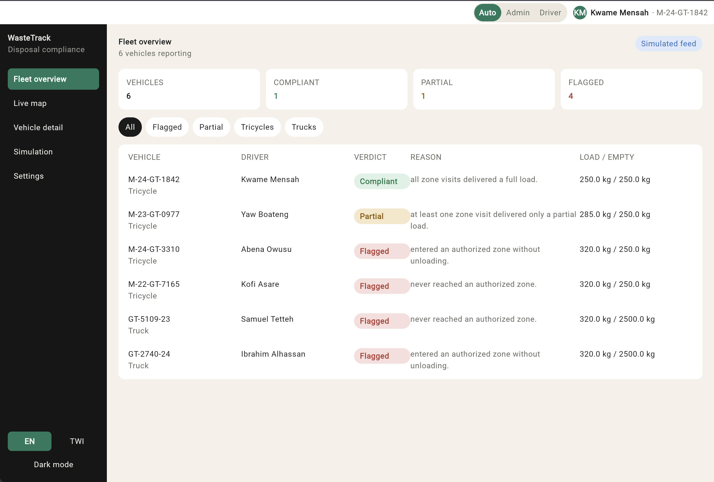
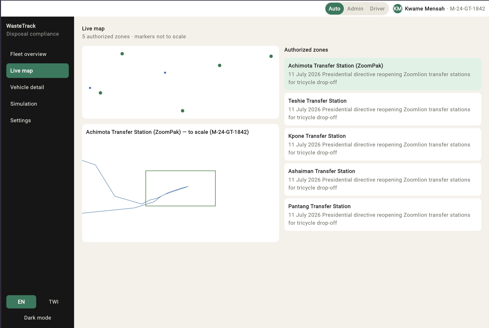

# WasteTrack

A compliance-detection layer for Ghana's waste-collection system, built as a Kotlin Multiplatform hackathon project.

## The problem

A July 2026 Presidential directive reopened six Zoomlion transfer stations for tricycle drop-off, to formalize how independent "aboboyaa" operators route through the authorized disposal system. An estimated 600-700 tons of waste a day is diverted away from authorized sites in the Accra area. Government and operators can mandate *where* waste should go — what they lack is per-vehicle evidence that it *actually went there*.

## The insight

GPS proves presence, not disposal. A driver can defeat a GPS-only compliance system by physically driving through an authorized zone without unloading — a "drive-through" trick. Comparing cargo weight at zone exit against a vehicle's known empty (tare) weight turns mere presence into evidence of an actual drop-off.

WasteTrack ingests a location signal and a weight signal per vehicle, checks each authorized-zone visit against tare weight, and produces a per-visit classification and an end-of-shift verdict — **Compliant**, **Partial**, or **Flagged** — live, as the vehicle moves.

## What this is (and isn't)

A compliance detection layer, not a deployed product. All data is simulated in-app from hardcoded Kotlin constants — no network calls, no file I/O. The five real zones and the July 2026 directive are researched and accurate; the engine, UI, and app were built for this hackathon, with AI-assisted coding throughout.

- **Admin (web, wide layout):** a fleet operations view — overview table, live map, per-vehicle detail, and a Simulation panel for the demo.
- **Driver (Android, narrow layout):** the vehicle operator's own live shift status, drop-off reminders and results, and shift summary.

Both are the *same* Compose Multiplatform codebase — `App()` picks the layout by screen width, not two separate apps. A manual Admin/Driver switch plus a profile chip sit in a top bar above both layouts, so one window can preview either without resizing.

## Architecture

```
shared/src/
  engine/     Pure Kotlin: models, point-in-polygon, classifier, shift evaluator, simulated reading source.
              Zero Compose/platform imports — this package would still compile if the entire UI were deleted.
  data/       Zone, vehicle, and scenario-route constants (real research, hardcoded, no JSON/network).
  ui/         FleetViewModel (single StateFlow), the adaptive App() shell, screens, shared components, theme.
shared/test/  EngineTest, LayoutBreakpointTest, FleetOverviewDataTest (multiplatform).
              JVM-only (test@jvm): FleetViewModelTest, SimulationDemoScriptTest — use
              runBlocking, which isn't available on the wasmJs target.
android-app/  MainActivity.kt — a few lines, calls App().
wasm-app/     main.kt — a few lines, calls App().
jvm-app/      Main.kt — desktop dev loop and fallback second platform.
```

Build tool is **Amper**, not Gradle — configuration lives in `project.yaml` and per-module `module.yaml` files.

## Running it

From the project root:

```bash
./kotlin run --module jvm-app       # desktop — fastest loop, use for iteration
./kotlin run --module android-app   # Android — needs a booted emulator or device
./kotlin run --module wasm-app      # web
```

To compile/test without touching the (out-of-scope) iOS target:

```bash
./kotlin build --module jvm-app --module shared --platform jvm
./kotlin test --include-module shared --platform jvm
```

## Screenshots

**Fleet overview** (admin) — real, distinct verdicts from the engine, not hardcoded rows:



**Live map** (admin) — city-wide markers (not to scale) plus a to-scale zoomed inset for the selected zone:



## The one thing to see if you only see one thing

Open the **Simulation** panel (admin, wide layout). Run the "Drive-through" scenario — same GPS trail as "Compliant," same everything, except the weight never drops while inside the zone. Watch the verdict land Flagged. Then drag the weight slider down to empty weight *while the vehicle is still inside the zone*, before it exits — the verdict flips to Compliant live, in front of you. Drag it back up — flips back to Flagged. Same route, different weight signal, different verdict, live. That's the entire pitch.

## Status

Engine, all screens, and the Simulation panel are built; the web build has been verified rendering correctly in a real browser (all 9 screens, both themes). Android compiles and packages to a real APK but hasn't been confirmed running, due to an emulator issue in the current build environment rather than the code. See `TODO.md` for the section-by-section build checklist and `handing_over.md` for a detailed account of what's built, key design decisions, known assumptions to confirm, and what's left.
